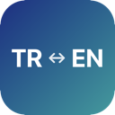
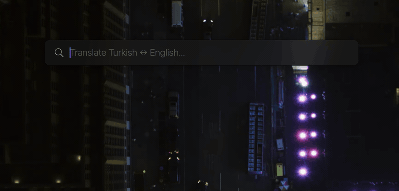

#  turkeng

A macOS menu bar app for instant Turkish ↔ English translation — with ghost text autocomplete and keyboard-first navigation.

<p align="center">
  
</p>

## What it does

turkeng lives in your menu bar and gives you a fast, keyboard-driven translation panel. Hit **⌥T** from anywhere, type your text, and get translations instantly — no browser tabs, no copy-pasting between apps.

**Auto Language Detection** — Uses Google Cloud Translation language detection when a Google-backed engine is active with an API key configured; otherwise falls back to Apple's NaturalLanguage framework.

**Ghost Text Autocomplete** — As you type, translucent suggestions appear based on your query history and a seed dictionary of common phrases. Press **Tab** or **→** to accept.

**Multiple Matches** — Returns up to 5 translation matches from MyMemory translation memory, ranked by confidence score. Navigate with **↑↓** and hit **Enter** to copy.

**Reverse Direction** — Press **⌘R** in the panel to flip the translation direction for the current input and rerun the query immediately.

**Google Translate Support** — Optionally use Google Cloud Translation as a backend (requires your own API key). Can be combined with other engines or used standalone.

## Install

Download the latest `.dmg` from [GitHub Releases](../../releases) and drag to Applications.

The app runs in the menu bar — no dock icon, no clutter. Press **⌥T** (Option+T) to open the translator.

## Google Translate Setup

turkeng supports Google Cloud Translation as an optional backend. To enable it:

1. Go to the [Google Cloud Console](https://console.cloud.google.com/)
2. Create a new project (or select an existing one)
3. Enable the **Cloud Translation API** — search for "Cloud Translation API" in the API Library and click **Enable**
4. Go to **APIs & Services → Credentials** and click **Create Credentials → API Key**
5. Copy the API key
6. In turkeng, open **Settings** (gear icon or **⌘,**) and select a backend that includes Google Translate
7. Paste your API key in the **Google Translate** section

> **Tip:** Restrict your API key to the Cloud Translation API only in the Google Cloud Console to limit exposure if it leaks. The key is stored locally on your Mac.

## Development

Built with Swift + SwiftUI, managed by [Tuist](https://tuist.io). Requires macOS 15.0+.

```bash
tuist install
tuist generate
open turkeng.xcworkspace
```
